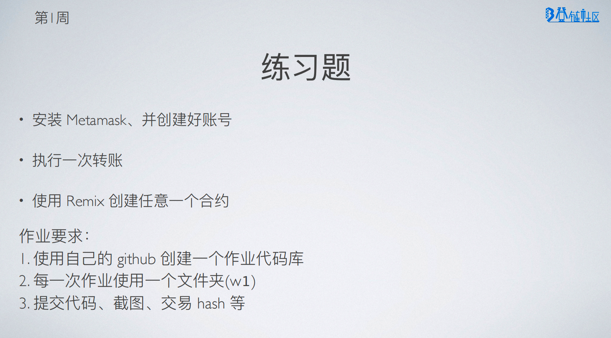

# 登链社区-区块链技术集训营二期作业【W1-1】

## 题目



## 解答


```solidity
// SPDX-License-Identifier: MIT

pragma solidity ^0.8.0;

contract Counter {
    
    uint public counter;

    constructor() {
        counter = 0;
    }
    
    function count() public {
        counter = counter + 1;
    }
    
    function add(uint x) public returns(uint){
        counter = counter + x;
        return counter;
    }
}
```
